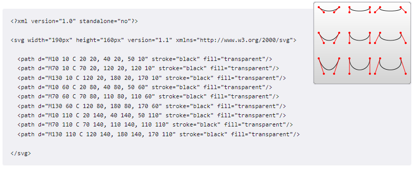
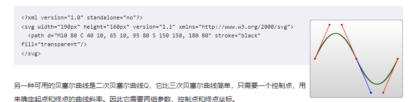
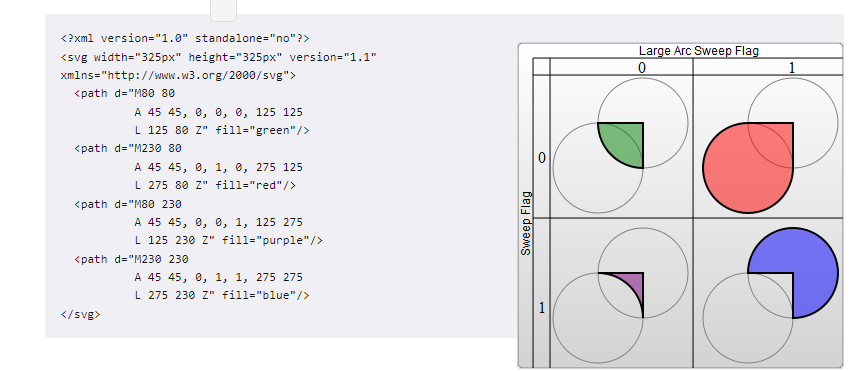

# path

`<path>`元素是SVG[基本形状](SVG.md#基本形状)中最强大的一个。path元素的形状是通过属性d定义的，属性d的值是一个“命令+参数”的序列。每一个命令都用一个关键字母来表示，比如，字母“M”表示的是“Move to”命令，当解析器读到这个命令时，它就知道你是打算移动到某个点。跟在命令字母后面的，是你需要移动到的那个点的x和y轴坐标。比如移动到(10,10)这个点的命令，应该写成“M 10 10”。这一段字符结束后，解析器就会去读下一段命令。每一个命令都有两种表示方式，一种是用**大写字母**，表示采用绝对定位。另一种是用**小写字母**，表示采用相对定位（例如：从上一个点开始，向上移动10px，向左移动7px）。

## 直线命令

```
大小写分别表示绝对定位和相对定位
M x y
表示move(移动不画线)到x，y座标处
L x y
表示"Line to"(画线)到x，y座标处
H x
表示绘制水平线
V y
表示绘制垂直线
Z(不区分大小写)
表示闭合线路，会画一条回到起点的直线
```

## 曲线命令

绘制平滑曲线的命令有三个，其中两个用来绘制贝塞尔曲线，另外一个用来绘制弧形或者说是圆的一部分。贝塞尔曲线的类型有很多，但是在path元素里，只存在两种贝塞尔曲线：三次贝塞尔曲线C，和二次贝塞尔曲线Q。

### 贝塞尔曲线

```
 C x1 y1, x2 y2, x y (or c dx1 dy1, dx2 dy2, dx dy)
```

这里的最后一个坐标(x,y)表示的是曲线的终点，另外两个坐标是控制点，(x1,y1)是起点的控制点，(x2,y2)是终点的控制点。


```
 S x2 y2, x y (or s dx2 dy2, dx dy)
```

S命令可以用来创建与前面一样的贝塞尔曲线，但是，如果S命令跟在一个C或S命令后面，则它的第一个控制点会被假设成前一个命令曲线的第二个控制点的中心对称点。如果S命令单独使用，前面没有C或S命令，那当前点将作为第一个控制点。下面是S命令的语法示例，图中左侧红色标记的点对应的控制点即为蓝色标记点。


另一种可用的贝塞尔曲线是二次贝塞尔曲线Q，它比三次贝塞尔曲线简单，只需要一个控制点，用来确定起点和终点的曲线斜率。因此它需要两组参数，控制点和终点坐标。

```
Q x1 y1, x y (or q dx1 dy1, dx dy)
```


就像三次贝塞尔曲线有一个S命令，二次贝塞尔曲线有一个差不多的T命令，可以通过更简短的参数，延长二次贝塞尔曲线。

```
 T x y (or t dx dy)
```

## 弧形

```
A rx ry x-axis-rotation large-arc-flag sweep-flag x y
a rx ry x-axis-rotation large-arc-flag sweep-flag dx dy

```

弧形命令A的前两个参数分别是x轴半径和y轴半径,x-axis-rotation（x轴旋转角度）,large-arc-flag（角度大小） 和sweep-flag（弧线方向），large-arc-flag决定弧线是大于还是小于180度，0表示小角度弧，1表示大角度弧。sweep-flag表示弧线的方向，0表示从起点到终点沿逆时针画弧，1表示从起点到终点沿顺时针画弧。

