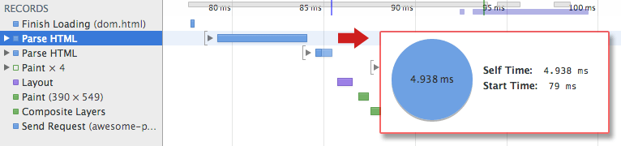

# Web 是怎么运转的

当我们在浏览器中输入google.com时屏幕后面发生了什么。

## 当按下google中的‘g’键

当你按下‘g’键时浏览器接收到这个事件然后整个自动补全机器开始高速运转。取决于你的浏览器的算法或是是否打开隐私模式，各种建议将会呈现在地址栏下的提示框中。这些算法中的大多数根据搜索历史和书签对结果进行优先排序。

## 当你按下‘enter’键

为了从头说起，让我们选择在键盘上桥下enter键。在此节点，一个特定于enter键的回路关闭（直接或电容式）。这允许少量的电流流入键盘的逻辑电路，扫描每个按键开关的状态，同时消除开关快速间歇性关闭的电气噪声，并将其转换为按键代码的整数，在这个例子中为13。然后，键盘控制器对键码进行编码，以便传送到计算机上。现在几乎普遍是通过通用串行总线（USB）或蓝牙进行连接。

对于USB键盘来说：

- 产生的键码由内部键盘电路存储器储存在一个称为 "endpoint" 的寄存器中
- 主机 USB 控制器每隔10毫秒就会轮询该 "endpoint"，所以它能得到存储在上面的键码值
- 这个值会送到 USB SIE（串行接口引擎），以最大速度 1.5 Mb/s（USB 2.0）发送
- 然后这个串行信号在计算机的主机 USB 控制器处被解码，并由计算机的人机接口设备（HID）通用键盘设备驱动程序进行解释
- 之后键值被传入操作系统的硬件抽象层

对于触摸屏键盘来说：

- 当用户将手指放在现代电容式触摸屏上时，少量的电流会被转移到手指上。这通过导电层的静电场构成了电路，并在屏幕上的那个点产生了电压降。然后，屏幕控制器产生一个中断，报告 "点击" 的坐标
- 然后，移动操作系统将其 GUI 元素（现在是虚拟键盘应用按钮）中的一个点击事件通知当前的应用程序
- 虚拟键盘现在可以触发一个软件中断，用于向操作系统发送 "按键被按下" 的信息
- 这个中断通知当前的应用程序有一个 "按键被按下" 事件

## 解析url

现在游览器有了以下信息包含在URL中（Uniform Resource Locator 统一资源定位）：

- 协议“http”:使用超文本传输协议
- 资源 "/"：检索主（索引）页

当没有协议或可验证的主域名时，浏览器会把地址栏中的文本给到默认的搜索引擎

## DNS寻找

浏览器会尝试找出输入域名后的IP地址。寻找过程如下：

- **浏览器缓存**：浏览器会缓存DNS记录一段时间，有趣的时，操作系统不会告诉浏览器DNS记录的存活时间，所以浏览器会缓存一个固定时间（不同浏览器通常在2-30分之间）。
- **操作系统缓存**：如果浏览器没有缓存对应记录，浏览器会执行系统指令。操作系统有自己的缓存。
- **路由缓存**：请求来到路由器，他也有自己的缓存
- **ISP DNS缓存**：下一个地点时ISP的DNS服务器。
- **递归查询**：你的ISP的DNS服务器开始一个递归查询。从根名称服务器，通过 .com 顶级名称服务器，到谷歌的名称服务器。通常情况下，DNS 服务器在缓存中会有 .com 名称服务器的名称，因此，没有必要访问根名称服务器。

下图展示了一个递归查询的过程：


一个担忧的地方是，DNS看起来一个主域名好像值对应以一个IP地址。幸运的时，有许多方式来改善：

- Round-robin DNS:一种DNS寻址后返回多个IP地址的解决方式。例如facebook.com实际上对应这四个IP地址。
- **负载均衡**是硬件的一部分，可以监听一个指定IP地址然后转发到其他的服务，主要站点通常会使用昂贵的高性能负载平衡器。
- **Geographic DNS**根据客户的地理位置，通过将域名映射到不同的 IP 地址来提高可扩展性。这对于托管那些不需要跟新的静态内容的网站是很有用的。
- Anycast 是一种路由技术，其中单个 IP 地址映射到多个物理服务器。不幸的是，Anycast不能很好地与 TCP 配合使用，并且很少在这种情况下使用。

大多数 DNS 服务器本身使用Anycast来实现 DNS 查找的高可用性和低延迟。Anycast服务（DNS 是一个很好的例子）的用户将始终连接到“最近的”（从路由协议的角度来看）DNS 服务器。这减少了延迟，并提供了一定程度的负载平衡（假设您的消费者均匀分布在您的网络中）。

## 打开一个socket+TLS握手

- 一旦浏览器收到目标服务的IP地址，它会拿着这个IP地址和端口号（HTTP协议默认80，HTTPS是443），去执行一个叫做socket的系统函数然后请求一个TCP socket流。
- 客户端电脑发送一个‘ClientHello ’信息和它的TLS版本、可用的密码算法和压缩方法列表去到服务区。
- 服务器回复ServerHello 消息和TLS 版本、选择的密码、选择的压缩方法和由 CA（证书颁发机构）签名的服务器的公共证书向客户端 。该证书包含一个公钥，客户端将使用该公钥来加密握手的其余部分，直到可以就对称密钥达成一致。
- 客户端根据其受信任的 CA 列表验证服务器数字证书，如果可以基于 CA 建立信任，则客户端会生成一串伪随机字节，并使用服务器的公钥对其进行加密。这些随机字节可用于确定对称密钥。
- 服务器使用其私钥解密随机字节，并使用这些字节生成自己的对称主密钥副本。
- 客户端向服务器发送 Finished 消息，使用对称密钥加密传输的哈希值。
- 服务器生成自己的哈希，然后解密客户端发送的哈希以验证它是否匹配。如果是这样，它会将自己的 Finished 消息发送给客户端，该消息也使用对称密钥加密。
- 从现在开始，TLS 会话传输使用约定的对称密钥加密的应用程序 (HTTP) 数据。

## HTTP协议

您可以非常确定 Facebook/Gmail 等动态网站不会从浏览器缓存中提供服务，因为动态页面会很快或立即过期（过期日期设置为过去）。

如果使用的网络浏览器是由 Google 编写的，它不会发送 HTTP 请求来检索页面，而是会发送请求以尝试与服务器协商从 HTTP 到 SPDY 协议的“升级”。请注意，在最新版本的 Chrome 中，SPDY 已被弃用，取而代之的是 HTTP/2。

```http
GET http://www.google.com/ HTTP/1.1
Accept: application/x-ms-application, image/jpeg, application/xaml+xml, [...]
User-Agent: Mozilla/4.0 (compatible; MSIE 8.0; Windows NT 6.1; WOW64; [...]
Accept-Encoding: gzip, deflate
Connection: Keep-Alive
Host: google.com
Cookie: datr=1265876274-[...]; locale=en_US; lsd=WW[...]; c_user=2101[...]
```

GET请求将要去获取的url命名为“<http://www.googlr.com/”。浏览器表明了自己的身份（user-agent> header）,接着表明了它将接收到的响应类型（Accept和Accept-Encoding header）。连接头要求服务端保持TCP链接为了之后的请求。

请求中也包括了这个域名下的cookies,可能你已经知道，cookies是许多键值对用于追踪网站在不同页面之间的状态。所以这颗cookies保存了登录的用户名、服务器分配给用户的密文、用户的一些设置等等。cookies会存在客户端的一个文本文件中，并在每次请求中发送给服务器。

HTTP/1.1 为发送者定义了“关闭”连接选项，以表明在响应完成后连接将被关闭。例如，连接：关闭。

在发送了请求和请求头之后，浏览器发送了一个空行给服务器，意思是请求内容结束。服务器以表示请求状态的响应代码进行响应，并以以下形式的响应进行响应：200 OK [响应标头]。

紧接着新奇一行，发送www.google.com的HTML的内容。接着服务器会关闭连接或是如果客户端需要，保持连接供后续请求重复使用。

如果浏览器发送的请求头包含了充足的信息使服务器能够确定是否上次浏览器缓存的文件版本在上次取回后没有被修改（例如浏览器包含了一个ETag头）,服务器会返回一个有304Not Modified响应头的响应并且没有内容，然后浏览器会在自己的缓存中取回HTML

在解析HTML之后，浏览器（和服务器）会在每一个HTML中引用的资源（image,css,favicon.ico等等）重复这个过程，除了 GET / HTTP/1.1 之外，请求将是 GET /$(URL relative to www.google.com) HTTP/1.1。

如果HTML引用了一个不同域名的资源，浏览器会回到解析其他域名的步骤，并按照该域的所有步骤进行操作。请求中的 Host 标头将设置为适当的服务器名称，而不是 google.com。

注意：

- “ <http://facebook.com/> ” 末尾的斜杠是重要的，在这里浏览器可以安全的加斜杠。对于 <http://example.com/folderOrFile> 这样的链接，浏览器不能自动添加一个斜杠，因为不能知道olderOrFile是一个文件还是目录。在这样的例子中浏览器会访问没有斜杠的URL，然后服务器将响应一个重定向，结果导致一次不必要的路由跳转。
- 服务器可能会以 301 Moved Permanently 响应来告诉浏览器转到“<http://www.google.com/”而不是“http://google.com/”。关于为什么服务器坚持重定向而不是立即响应页面有几个有趣的原因。其中一个原因是需要做搜索引擎排名。看如果有两个URl指向通过以页面，搜索引擎可能会认为他们是不同的网站，每个都有较少的传入链接，因此排名较低。搜索引擎了解301重定向，然后会将两个源的链接合并到一个排名。同时，关于同意内容的多URL>对缓存不友好，当同意内容有多个多个名称，可能导致在缓存中存储多次。

注意：HTTP响应从服务端返回的状态码开始。以下是一些关于状态码意思的简短的总结：

- 1xx表示信息消息
- 2xx表示成功类型
- 3xx表示重定向到另一URL
- 4xx表示客户端错误
- 5xx表示服务端错误

## HTTP服务器请求处理

HTTPD(HTTP Daemon) 服务器用于在服务端处理请求、响应。最普遍的HTTPD服务器有Apache、IIS windows平台、nginx Linux平台等。

- HTTPD收到请求
- 服务器将请求拆分成以下部分
  - HTTP请求方法（GET、POST、HEAD、PUT、DELETE）。像这个案例一样直接在地址栏输入，是一个GET请求。
  - Domain（域名）。例如：<http://www.google.com/>。
  - URL（资源路径）。例如：/index.html。
  - 服务器将言获赠是否有一个虚拟主机配置在当前服务器上对应到google.com。
- 服务器验证Google.com可以接收GET请求。
- 服务器验证客户端是否允许使用此method（通过IP，authentication等等）
- 如果服务器有安装了重写模块（比如Apache上的mod_rewrite或IIS上的URL Rewrite）,他会尝试匹配请求和配置规则，如果匹配到了，服务器换使用那条鬼册对请求进行重写。
- 服务器去拉取与请求对应的内容，在我们的例子中它将回退到索引文件，因为“/”是主文件（某些情况可以覆盖它，但这是最常用的方法）
- 服务器根据请求处理程序解析文件。请求处理程序是读取请求并为响应生成 HTML 的程序（在 ASP.NET、PHP、Ruby 等中）。如果 Google 在 PHP 上运行，则服务器使用 PHP 来解释索引文件，并将输出流式传输到客户端。

注意：每个动态网站都面临的一个有趣的困难是如何存储数据。较小的站点通常只有一个 SQL 数据库来存储他们的数据，但是存储大量数据和/或有很多访问者的站点必须找到一种方法来将数据库拆分到多台机器上。解决方案包括分片（根据主键在多个数据库中拆分表）、复制和使用具有弱一致性语义的简化数据库。

## 服务器响应

```http
HTTP/1.1 200 OK
Cache-Control: private, no-store, no-cache, must-revalidate, post-check=0,
    pre-check=0
Expires: Sat, 01 Jan 2000 00:00:00 GMT
P3P: CP="DSP LAW"
Pragma: no-cache
Content-Encoding: gzip
Content-Type: text/html; charset=utf-8
X-Connection: close
Transfer-Encoding: chunked
Date: Fri, 12 Feb 2010 09:05:55 GMT
2b3
��������T�n�@����[...]
```

整个响应有36KB，它们中的大部分在我修剪的末尾的字节块中。

Content-Encoding 标头告诉浏览器响应正文是使用 gzip 算法压缩的。解压缩 blob 后，您将看到您期望的 HTML：

```html
<!DOCTYPE html PUBLIC "-//W3C//DTD XHTML 1.0 Strict//EN"
      "http://www.w3.org/TR/xhtml1/DTD/xhtml1-strict.dtd">
<html xmlns="http://www.w3.org/1999/xhtml" xml:lang="en"
      lang="en" id="google" class=" no_js">
<head>
<meta http-equiv="Content-type" content="text/html; charset=utf-8" />
<meta http-equiv="Content-language" content="en" />
...
```

请注意将 Content-Type 设置为 text/html 的标头。标头指示浏览器将响应内容呈现为 HTML，而不是将其下载为文件。浏览器将使用标头来决定如何解释响应，但也会考虑其他因素，例如 URL 的扩展名。

## 浏览器的幕后

一旦服务器向浏览器提供资源（HTML、CSS、JS、图像等），它就会经历以下过程：

- 解析 - HTML、CSS、JS
- 渲染 - 构造 DOM 树 → 渲染树 → 渲染树布局 → 绘制渲染树

## 浏览器的高层结构

1. 用户界面：包括了地址栏、后退前进按钮、书签菜单等等。除了您看到请求页面的窗口之外，浏览器的每个部分都会显示。
2. 浏览器引擎：编组 UI 和渲染引擎之间的操作.
3. 渲染引擎负责显示请求的内容。例如。渲染引擎解析 HTML 和 CSS，并将解析后的内容显示在屏幕上。
4. 网络：对于诸如 HTTP 请求之类的网络调用，针对不同平台使用不同的实现（在与平台无关的接口之后）。
5. UI 后端：用于绘制基本小部件，如组合框和窗口。此后端公开了一个非平台特定的通用接口。在它下面使用操作系统用户界面方法。
6. JavaScript 引擎：用于解析和执行 JavaScript 代码的解释器。
7. 数据存储：这是一个持久层。浏览器可能需要在本地保存数据，例如 cookie。浏览器还支持 localStorage、IndexedDB 和 FileSystem 等存储机制。


让我们开始，通过一个最简单的例子，一个简单HTML页面有一些文字和一张图片，浏览器会怎么处理这个简单的页面？

1. 转换：浏览器浏览器通过网络或者硬盘读到HTMl的源字节，然后基于编码（比如UTF-8）将他们翻译成独立的字符。
2. 序列化：浏览器将字符串转化成不同的标记，基于W3C HTML5标准，每一个标记有它特殊的含义
3. 词法分析：发出的标记被转换为定义其属性和规则的“对象”。
4. DOM结构：最终，由于HTML标记定义了不同标签间的关系（一些标签包含了另一些）创建的对象别连接在一个树形结构上，并且捕获到了源标记上的父子结构：HTML对象是body对象的父对象，body对象是
p对象的父节点等等。


整个过程最终的输出是一种文档对象模型（DOM）,浏览器用DOM来处理后面的操作。

每一次浏览器需要处理HTML标记时，它必须执行以上步骤：将字节转换为字符，识别令牌，将令牌转换为节点，并构建 DOM 树。整个过程可能需要一些时间，尤其是当我们要处理大量 HTML 时。


如果您在页面加载时打开 Chrome DevTools 并记录时间线，您可以看到执行此步骤所花费的实际时间——在上面的示例中，我们花了大约 5 毫秒将一大块 HTML 字节转换为 DOM 树。当然，如果页面更大，就像大多数页面一样，这个过程可能需要更长的时间。您将在我们以后创建流畅动画的部分中看到，如果浏览器必须处理大量 HTML，这很容易成为您的瓶颈。

## 渲染引擎

=渲染引擎是一种软件组件用于拿到标记文本（例如HTML，XML，图片文件等等）和格式化信息（例如CSS,XSL等等）然后将他们展示这些格式化的内同在频幕上。

| Browser | Engin  |
| :------ | :----- |
| Chrome  | Blink  |
| Firefox | Gecko  |
| Safari  | WebKit |
| Opera   | Blink  |
WebKit时一个开源渲染引擎，最初用于Linux平台然后被Apple修改用于指出Mac和Windows平台。

渲染引擎是单线程。几乎所有除了网络操作都发生在单线程。在Firefox和Safari这是浏览器的主线程。在 Chrome 中，它是选项卡进程主线程，网络操作可以由多个并行线程执行。并行连接的数量是有限的（通常每个主机名有 6-13 个连接）。
浏览器主线程是一个事件循环。这是一个无限循环，使进程保持活力。它等待事件（如布局和绘制事件）并处理它们。

注意：Chrome 等浏览器运行多个渲染引擎实例：每个选项卡一个。每个选项卡在单独的进程中运行。

## 主流程

渲染引擎将开始从网络层获取所请求文档的内容。这通常以 8KB 的块完成。

之后渲染引擎的主流程如下：


渲染引擎将开始html文档并将元素转化为“content tree”的DOM节点树。

引擎将解析样式数据，包括外部css文件和样式元素。样式信息和可见的HTMl结构将被用于创建另一种树：渲染树。渲染树包含具有颜色和尺寸等视觉属性的矩形，矩形按正确的顺序显示在屏幕上。

在渲染树的结构进行了“布局”过程之后。意味着每一个节点有了明确的坐标，出现的位置。

下一阶段是“绘制”渲染树将会被遍历并且每一个节点将被绘制通过UI后端层。

理解这是一个渐进过程是十分重要的。为了更好的使用体验，渲染引擎将会尽快的在屏幕上展示内容。它不会等全部HTMl被解析完才开始构建和布局渲染树。一部分内容将被解析并展示，同时进程继续处理剩余的从网络传输过来的内容。

下边是WebKit的渲染流程图：


## 解析基础

解析：将文档翻译成代码能使用的结构。解析的结果通常是一棵代表了文档结构的节点树。

语法：解析基于文档遵循的语法规则：它所用的语言或格式。您可以解析的每种格式都必须具有由词汇和语法规则组成的确定性语法。它被称为上下文无关文法。
解析可以分为两个子过程：词法分析和句法分析。

词法分析：将输入分解为标记的过程。标记是语言词汇表：有效构建块的集合。

语法分析：语言语法规则的应用。

解析器通常将工作分为两个组件：负责将输入分解为有效标记的词法分析器（有时称为标记器），解析器负责根据语言语法规则分析文档结构，构建解析树。词法分析器知道如何去除不相关的字符，如空格和换行符。


解析过程是迭代的的，解析器通常会向词法分析器要一个新的令牌然后去匹配语法规则，如果有规则匹配，一个对应标记的节点将别加入到解析树中然后解析器请求下一个令牌。

如果没有匹配到规则，解析器将在内部存储令牌，并不断请求令牌，直到找到匹配所有内部存储令牌的规则。如果没有找到规则，则解析器将引发异常。这意味着该文档无效并且包含语法错误。

HTML 解析器的工作是将 HTML 标记解析为解析树。HTML 定义采用 DTD（文档类型定义）格式。此格式用于定义 SGML 系列的语言。该格式包含所有允许的元素、它们的属性和层次结构的定义。正如我们之前看到的，HTML DTD 没有形成上下文无关文法。

HTML解析算法包括两个阶段：标记化和树构造。

标记化是词法分析，将输入解析为令牌。HTML 标记包括开始标记、结束标记、属性名称和属性值。
标记器识别标记，将其提供给树构造函数，并使用下一个字符来识别下一个标记，依此类推，直到输入结束。

## DOM Tree

输出树（“分析树”）是 DOM 元素和属性节点的树。DOM 是文档对象模型的缩写。它是 HTML 文档的对象表示，也是 HTML 元素与 JavaScript 等外部世界的接口。树的根是“文档”对象。
DOM 与标记几乎是一对一的关系。例如：

```html
<html>
  <body>
    <p>
      Hello World
    </p>
    <div> </div>
  </body>
</html>
```

此标记将被转换为以下 DOM 树：


## 为什么Dom很慢？

简单的回答是Dom并不慢，添加和删​​除 DOM 节点是一些指针交换，只不过是在 JS 对象上设置一个属性。
但是，布局很慢。当你以任何方式接触 DOM 时，你在整个树上设置了一个脏位，告诉浏览器它需要重新计算所有内容的去向。当 JS 将控制权交还给浏览器时，它调用它的布局算法（或者更专业地说，它调用它的 CSS 重新计算算法，然后是布局，然后重新绘制，然后重新合成）来重新绘制屏幕。布局算法相当复杂——阅读 CSS 规范以了解一些规则——这意味着它通常必须做出非本地决策。

更糟糕的是，布局是通过访问某些属性同步触发的。其中包括 getComputedStyleValue()、getBoundingClientWidth()、.offsetWidth、.offsetHeight 等，这使得它们很容易被碰到。正因为如此，很多 Angular 和 JQuery 代码都非常缓慢。一次布局将耗尽您在移动设备上的整个帧预算。当我测量 Google Instant c。 2013年，一次查询导致13个布局，在移动设备上锁屏近2秒。 （它已经被加速了。）

React 无助于加速布局——如果你想在移动 Web 浏览器上实现流畅的动画，你需要求助于其他技术，比如将你在帧中所做的一切限制为可以在 GPU 上执行的操作。但它所做的是确保每次更新页面状态时最多执行一个布局。这通常是对现状的相当大的改善。

## 渲染树与 DOM 树的关系

但这种关系不是一对一的。
渲染器对应于 DOM 元素，非可视 DOM 元素不会插入到渲染树中。一个例子是“head”元素。此外，其显示值被分配为“无”的元素将不会出现在树中（而具有“隐藏”可见性的元素将出现在树中）。

有的DOM 元素对应于几个视觉对象 。这些通常是结构复杂的元素，不能用单个矩形来描述。例如，“select”元素有三个渲染器：一个用于显示区域，一个用于下拉列表框，一个用于按钮。此外，当由于一行的宽度不足而将文本分成多行时，新行将作为额外的渲染器添加。

一些渲染对象对应着一个DOM节点但是不在一颗树上的同一位置。浮动和绝对定位元素是脱离流的，放置在树中不同位置，并映射到真实框架。它们应该在的地方是占位符框架。


在 WebKit 中，解析样式和创建渲染器的过程称为“attach”。每个 DOM 节点都有一个“附加”方法。附件是同步的，节点插入到 DOM 树中调用新的节点“attach”方法。

构建渲染树需要计算每个渲染对象的视觉属性。这是通过计算每个元素的样式属性来完成的。样式包括各种来源的样式表、内联样式元素和 HTML 中的可视属性（如“bgcolor”属性）。后者被翻译为匹配的 CSS 样式属性。

## CSS Parsing

CSS选择器会被浏览器引擎从右到左进行匹配。记住当浏览器进行选择器匹配，将会有一个元素（那个需要被确认样式的）和所有的规则和规则的选择器然后需要找到哪个规则匹配这个元素。这和jQuery这样的是不一样的，这种是你有一个选择器然后去匹配所有匹配到的元素。

选择器的特异性计算如下：

- 如果它来自的声明是“样式”属性而不是带有选择器的规则，则计数为 1，否则为 0 (= a)
- 统计选择器中ID选择器的个数（=b）
- 统计选择器中类选择器、属性选择器、伪类的个数（=c）
- 统计选择器中元素名和伪元素的个数（=d）
- 忽略通用选择器

连接三个数字 a-b-c-d（在具有大基数的数字系统中）给出了特异性。您需要使用的数字基数由您在 a、b、c 和 d 之一中的最高计数定义。

```css
*               /* a=0 b=0 c=0 -> specificity =   0 */
LI              /* a=0 b=0 c=1 -> specificity =   1 */
UL LI           /* a=0 b=0 c=2 -> specificity =   2 */
UL OL+LI        /* a=0 b=0 c=3 -> specificity =   3 */
H1 + *[REL=up]  /* a=0 b=1 c=1 -> specificity =  11 */
UL OL LI.red    /* a=0 b=1 c=3 -> specificity =  13 */
LI.red.level    /* a=0 b=2 c=1 -> specificity =  21 */
#x34y           /* a=1 b=0 c=0 -> specificity = 100 */
#s12:not(FOO)   /* a=1 b=0 c=1 -> specificity = 101 */
```

为什么CSSOM有一个树结构？在计算页面上任何对象的最终样式集时，浏览器从适用于该节点的最通用规则开始（例如，如果它是 body 元素的子元素，则应用所有 body 样式）然后通过应用更具体的规则递归地细化计算的样式 - 即规则“向下级联”。
WebKit 使用一个标志来标记是否所有顶级样式表（包括@imports）都已加载。如果附加时样式未完全加载，则使用占位符并在文档中标记，一旦加载样式表，将重新计算它们。

## 布局

当渲染器被创建并添加到树中时，它没有位置和大小。计算这些值称为布局或回流。
HTML 使用基于流的布局模型，这意味着大多数时候可以一次计算几何图形。 “流中”较晚的元素通常不会影响“流中”较早的元素的几何形状，因此布局可以在文档中从左到右、从上到下进行。坐标系是相对于根框架的。使用顶部和左侧坐标。

布局是一个递归过程。它从根渲染器开始，它对应于 HTML 文档的元素。布局通过部分或全部帧层次递归地继续，为每个需要它的渲染器计算几何信息。

根渲染器的位置是 0,0，它的尺寸是视口——浏览器窗口的可见部分。所有渲染器都有一个“布局”或“回流”方法，每个渲染器调用其需要布局的子级的布局方法。

为了不为每一个小的变化做一个完整的布局，浏览器使用一个“脏位”系统。更改或添加的渲染器将其自身及其子级标记为“脏”：需要布局。有两个标志：“脏”和“孩子很脏”，这意味着虽然渲染器本身可能没问题，但它至少有一个需要布局的孩子。

布局通常具有以下模式：

- 父渲染器确定自己的宽度。
- 从父级到子级：
  - 放置子集渲染器（设置它的xy）
  - 如果需要，调用子布局——它们有脏标志，或者我们处于全局布局中，或者出于其他原因——计算孩子的高度。
- 父级使用子级的累积高度以及边距和填充的高度来设置自己的高度——这将由父级渲染器的父级使用。
- 将其脏位设置为假。

另请注意，布局抖动是 Web 浏览器在“加载”页面之前必须多次重排或重绘网页的地方。在javaScript流行之前网站基本只需要布局或绘制一次，但现今用javascript去修改dom在网页加载中是十分常见的因此带来了额外的重回绘和回流，基于回流的数量和网站的复杂，可能会导致页面加载的延迟，特别是在低功率的机器上比如手机和平板。

## 绘制

在绘制阶段，遍历渲染树并调用渲染器的“paint()”方法在屏幕上显示内容。绘画使用 UI 基础结构组件。

像布局一样，绘画也可以是全局的——整棵树被绘制——或增量。在增量绘制中，一些渲染器的变化不会影响整个树。更改后的渲染器使其在屏幕上的矩形无效。这会导致操作系统将其视为“脏区”并生成“绘制”事件。操作系统巧妙地做到了这一点，并将几个区域合并为一个。

在重新绘制之前，WebKit 将旧矩形保存为位图。然后它只绘制新旧矩形之间的增量。浏览器会尝试执行尽可能少的操作以响应更改。因此，对元素颜色的更改只会导致元素的重绘。对元素位置的更改将导致元素、其子元素和可能的兄弟元素的布局和重绘。添加 DOM 节点将导致节点的布局和重绘。重大更改，例如增加“html”元素的字体大小，将导致缓存失效、重新布局和重新绘制整个树。
有三种不同的定位方案：

- 正常：对象根据其在文档中的位置定位。这意味着它在渲染树中的位置就像它在 DOM 树中的位置一样，并根据其框类型和尺寸进行布局
- 浮动：对象首先像正常流一样布局，然后尽可能向左或向右移动
- 绝对：对象被放置在渲染树中与 DOM 树中不同的位置

定位方案由“position”属性和“float”属性设置。

- 静态和相对导致正常流动
- 绝对和固定原因绝对定位

在静态定位中，没有定义位置，而是使用默认定位。在其他方案中，作者指定位置：上、下、左、右。

层由 z-index CSS 属性指定。它代表盒子的第三个维度：它沿“z 轴”的位置。

这些盒子被分成堆栈（称为堆栈上下文）。在每个堆栈中，后面的元素将首先被绘制，前面的元素在顶部，更靠近用户。如果重叠，最前面的元素将隐藏前一个元素。堆栈根据 z-index 属性进行排序。具有“z-index”属性的框形成一个本地堆栈。

## 其他

### 网络的诞生

欧洲核子研究中心的英国科学家蒂姆·伯纳斯-李于 1989 年发明了万维网 (WWW)。网络最初的构思和开发是为了满足世界各地大学和研究所科学家之间自动信息共享的需求。

CERN 的第一个网站——也是世界上的第一个网站——专门用于万维网项目本身，并托管在 Berners-Lee 的 NeXT 计算机上。该网站描述了网络的基本特征；如何访问其他人的文档以及如何设置自己的服务器。NeXT 机器——最初的网络服务器——仍然在 CERN。作为恢复第一个网站项目的一部分，2013 年 CERN 将世界上第一个网站恢复到其原始地址。
1993 年 4 月 30 日，CERN 将万维网软件置于公共领域。CERN 以开放许可的形式提供了下一个版本，作为最大化其传播的一种更可靠的方式。通过这些行动，免费提供运行网络服务器所需的软件，以及基本的浏览器和代码库，网络得以蓬勃发展。

*More reading:*

[What really happens when you navigate to a URL](http://igoro.com/archive/what-really-happens-when-you-navigate-to-a-url/)

[How Browsers Work: Behind the scenes of modern web browsers](http://www.html5rocks.com/en/tutorials/internals/howbrowserswork/)

[What exactly happens when you browse a website in your browser?](http://superuser.com/questions/31468/what-exactly-happens-when-you-browse-a-website-in-your-browser)

[What happens when](https://github.com/alex/what-happens-when)

[So how does the browser actually render a website](https://www.youtube.com/watch?v=SmE4OwHztCc)

[Constructing the Object Model](https://developers.google.com/web/fundamentals/performance/critical-rendering-path/constructing-the-object-model)

[How the Web Works: A Primer for Newcomers to Web Development (or anyone, really)](https://medium.freecodecamp.com/how-the-web-works-a-primer-for-newcomers-to-web-development-or-anyone-really-b4584e63585c#.7l3tokoh1)
