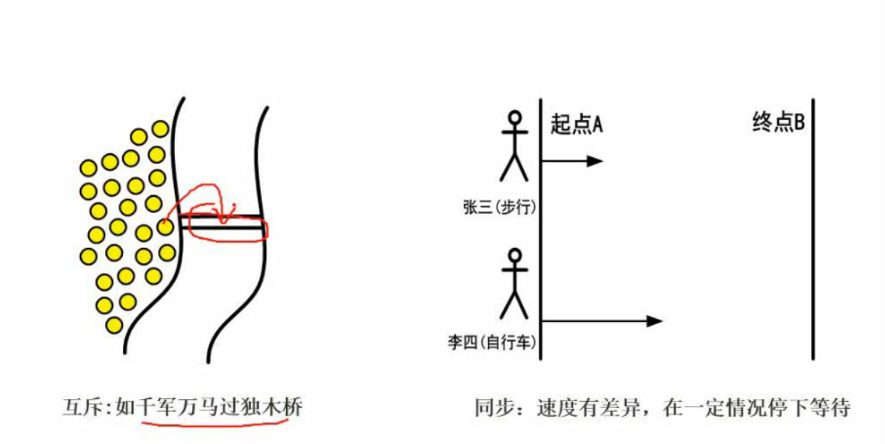
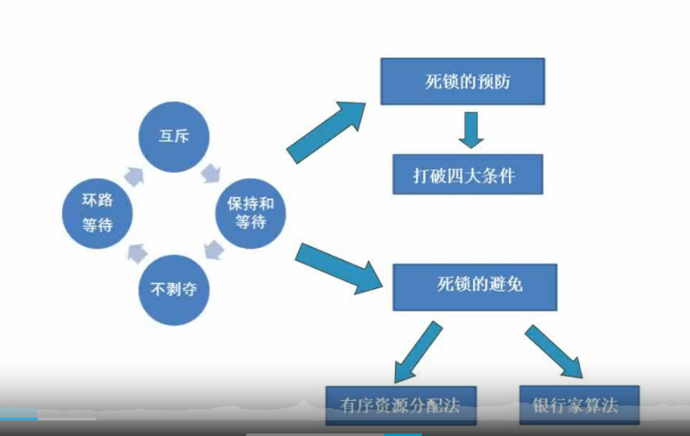
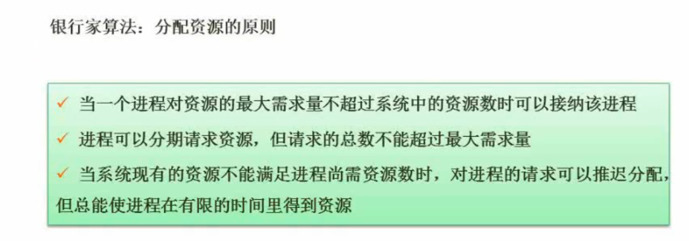

# 操作系统原理

- **进程管理**
- **存储管理**
- **文件管理**
- 作业管理
- 设备管理
- **微内核管理**

## 进程管理

### 前趋图

### 进程的同步与互斥

### *PV操作

### 死锁

### *银行家算法

## 存储管理

- 页式存储组织
- 页面置换算法

## 文件管理

- 索引文件结构
- 文件和树形目录结构
- 空闲存储空间管理
