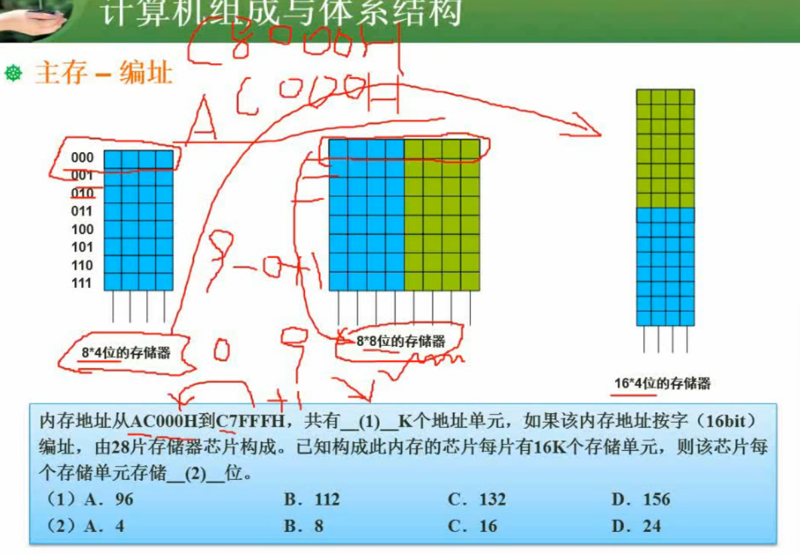
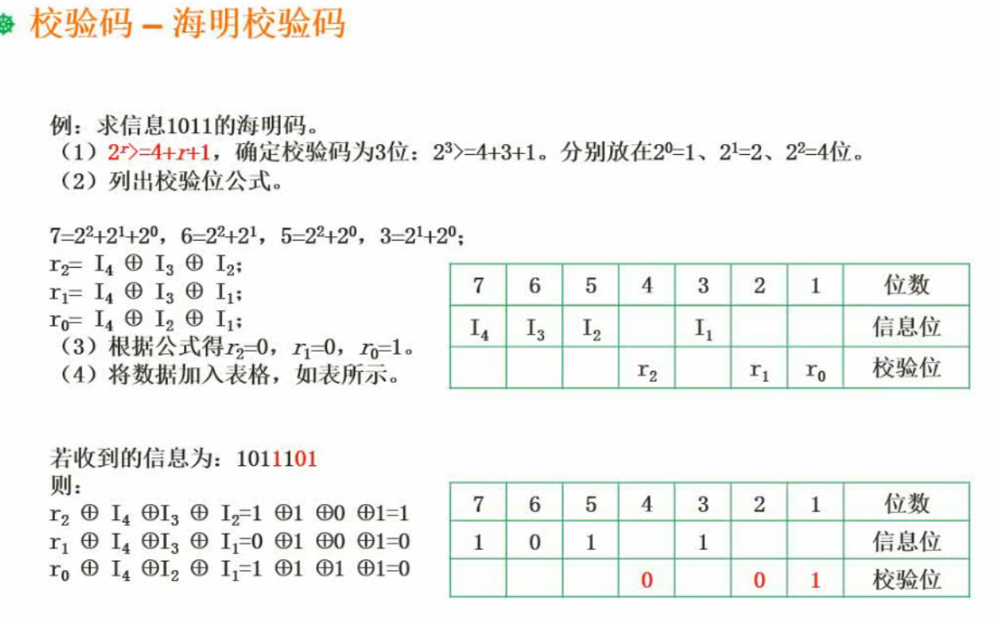

# 计算机组成

## 数据的表示

- R进制转10进止
- 10进制转R进制（短除法）

- 源码 负数首位取1
- 反码 正数与源码相同，负数除符号位取反
- 补码  正数与源码相同，负数除符号位取反+1
- 移码 （用于浮点运算）补码首位取反

### 浮点数表示

$N=M*R^e$

`M`称为位数`e`是指数，`R`为基数

## 计算机结构

- CPU
  - 运算器
    1. 算术逻辑单元ALU-负责计算加减乘除
    2. 累加寄存器AC-负责计算累加自增
    3. 数据缓冲寄存器DR-负责存储数据
    4. 状态条件寄存器PSW
  - 控制器
    1. 程序计数器PC
    2. 指令寄存器IR
    3. 指令译码器
    4. 时序部件-负责控制执行节奏节奏（比如电脑的超频就是把时序部件的频率调快 ）
- RAM(Random Access Memory) 内存

8位机器进行一次操作：前4位代表指令，后4位代表数据，程序计数器PC从0开始，从RAM的0处取出指令，放入指令寄存器，指令寄存器进行解码，然后执行指令执行完毕后，PC加1，重复执行。

具体查看B站视频[cpu](https://www.bilibili.com/video/BV1EW411u7th?p=7)

## Flynn-计算机体系结构分类

| 体系结构类型 | 结构 | 固件特性 | 代表 |
| ------------ | ---- | -------- | ---- |
|              |      |          |      |

## CISC与RISC

| 指令系统类型 | 指令                                                                                   | 寻址方式   | 实现方式                                             | 其他                        |
| ------------ | -------------------------------------------------------------------------------------- | ---------- | ---------------------------------------------------- | :-------------------------- |
| CISC(复杂)   | 数量多，使用频率差别大，可变长格式                                                     | 支持多种   | 微程序控制技术（微码）                               | 研制周期长                  |
| RISC（精简） | 数量少，使用频率接近，定长格式，大部分为单周期指令，操作寄存器，纸篓Load/Store操作内存 | 支持方式少 | 增加了通用寄存器；硬布线逻辑控制为主；适合采用流水线 | 优化编译 ，有效支持高级语言 |

## 流水线

流水线是指程序在执行多条指令重叠进行操作的一种准并行处理实现技术。各种部件同时处理是针对不同指令而言的，它们可同时为多条指令的不同部分进行工作，以提高各部件的利用率和指令的平均执行速度

- 流水线周期：执行时间最长的一段
- 计算公式
  - 1条指令执行事件+（指令条数-1）*流水线周期
  - 理论公式：$(t1+t2+...tk)+(n-1)*\delta t$  
  - 实践公式：$(k+n-1)* \delta t$  

- 流水线吞吐率
  - $指令条数/流水线执行时见$
  - 流水线最大吞吐率：$1/ \delta t$
- 流水线的加速比
  - $不使用流水线的执行时间/流水线的执行时间$
- 流水线的效率
  - 总时空区/流水线占用的时空区

## 层次化存储结构

速度从快到慢

1. Cpu
2. Cache
3. 内存（主存）
4. 外存（副存）

虚拟存储体系由主存和副存组成

### 主存

### 磁盘结构与参数

存存取时间=寻道时间+等待时间（平均定位时间+转动延迟）

## 校验码

### 循环校验码CRC

### 海明校验码

